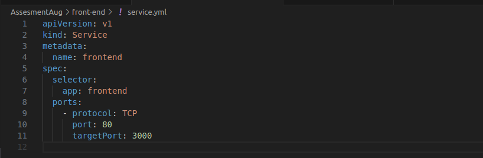

Assessment Aug2

Tasks and Deliverables

Task 1: Git Repository Setup

1\. Create a Git repository to store all project files, including
Ansible playbooks,

Dockerfiles, and Kubernetes manifests

2\. Branching Strategy:

○ Create branches for development, testing, and production.

○ Implement a strategy for merging changes from development to testing
and

production.Task 2: Dockerize Microservices

1\. Create Dockerfiles for each microservice (front-end, product
catalog, order

processing).

2\. Build Docker images for each microservice and push them to a
container registry

(e.g., Docker Hub).

3\. Deliverables:

○ Dockerfiles for each microservice

○ Built Docker images in a container registry

Task 3: Kubernetes Deployment

1\. Create Kubernetes manifests for deploying each microservice.

○ Define Pods, Services, Deployments, and ReplicaSets.

○ Use ConfigMaps and Secrets for configuration management.

2\. Deploy the microservices to a Kubernetes cluster.

3\. Deliverables:

○ Kubernetes manifests (YAML files)

○ Successful deployment of microservices in the Kubernetes cluster

